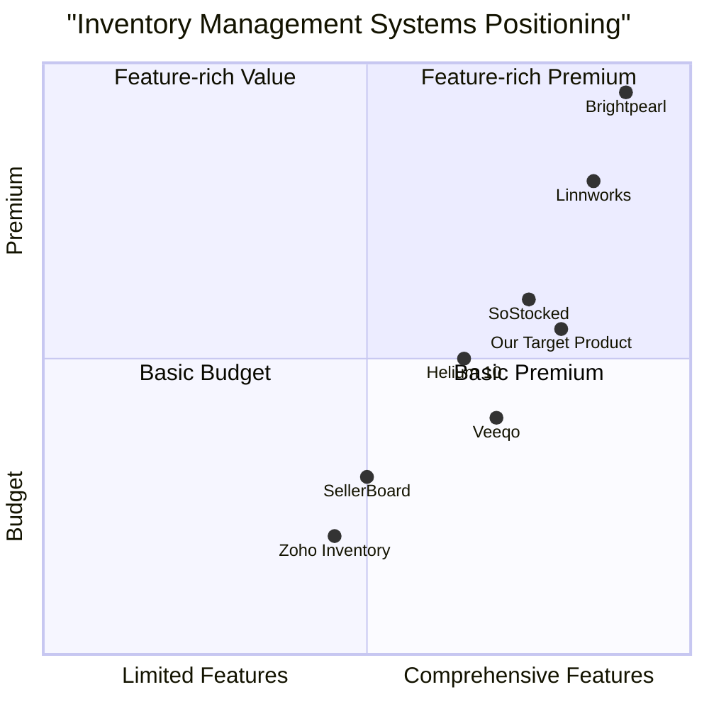

# Amazon Barcode Scanner Inventory Management System
Product Requirements Document (PRD)

## Table of Contents
1. [Introduction](#1-introduction)
2. [Market Research](#2-market-research)
3. [Competitive Analysis](#3-competitive-analysis)
4. [Product Definition](#4-product-definition)
5. [User Personas and Stories](#5-user-personas-and-stories)
6. [Requirements Specification](#6-requirements-specification)
7. [Technical Specifications](#7-technical-specifications)
8. [Security Requirements](#8-security-requirements)
9. [Deployment Considerations](#9-deployment-considerations)
10. [Open Questions](#10-open-questions)

## 1. Introduction

### 1.1 Purpose
This Product Requirements Document (PRD) outlines the specifications and features for an Amazon Barcode Scanner Inventory Management System tailored for bin stores. The system aims to streamline inventory management for Amazon sellers through barcode scanning technology, real-time inventory tracking, and comprehensive reporting capabilities.

### 1.2 Project Scope
The Amazon Barcode Scanner Inventory Management System is a full-stack web application that will include:
- Frontend user interface built with React/Next.js and Tailwind CSS
- Backend API services using Django
- PostgreSQL database for data storage
- Barcode scanning functionality for Amazon FNSKU codes
- User authentication with role-based access control
- Comprehensive inventory management features
- Reporting and analytics capabilities
- Notification systems for inventory alerts
- Security features to protect sensitive data

### 1.3 Intended Audience
This document is intended for:
- Development team members
- Project stakeholders
- QA testers
- Amazon sellers and inventory managers who will use the system

### 1.4 Project Goals
- Create a robust inventory management system specifically designed for Amazon sellers
- Streamline inventory tracking through barcode scanning technology
- Reduce human error in inventory management
- Provide actionable insights through reporting and analytics
- Enable real-time inventory visibility across multiple locations
- Support multiple user roles with appropriate access controls

## 2. Market Research

### 2.1 Market Overview
The Amazon inventory management systems market has seen significant growth in 2024. Key market indicators include:

- Approximately 1.35 million new sellers joined Amazon in 2024
- Third-party sellers account for 61% of overall Amazon sales
- Most sellers operate with monthly revenues between $1,000 and $25,000
- Average profit margins for Amazon sellers range between 21-25%

### 2.2 Market Drivers

1. **Rising Storage Fees**: Amazon's storage fees increased by 18% in 2024, with Q4 long-term storage fees reaching up to £20+ per cubic foot, creating pressure on sellers to optimize inventory.

2. **FBA Capacity Limits**: Amazon's switch from weekly restock limits to monthly FBA capacity limits has increased complexity in inventory management.

3. **Customer Expectations**: 68% of U.S. consumers expect delivery within three days, necessitating optimal inventory levels.

4. **Technology Adoption**: Approximately 73% of successful sellers now use automated inventory management systems.

5. **Cost of Poor Management**: The average seller loses approximately £3,200 per day during stockouts and experiences a drop of 4.1 sales rank positions.

### 2.3 Target Market
The primary target market for the Amazon Barcode Scanner Inventory Management System includes:

- Small to medium-sized Amazon sellers (1,000-25,000 monthly revenue)
- Amazon sellers with physical inventory in warehouses or bin stores
- Multi-channel retailers who sell on Amazon and other platforms
- Amazon sellers dealing with high SKU counts and complex inventory

### 2.4 Market Needs
Based on market research, Amazon sellers require:

1. **Accurate Inventory Tracking**: Real-time visibility into inventory levels across locations
2. **Streamlined Operations**: Efficient processes for receiving, storing, and fulfilling orders
3. **Cost Management**: Tools to optimize inventory levels and avoid FBA storage fees
4. **Integration Capabilities**: Seamless connection with Amazon Seller Central and other platforms
5. **Actionable Insights**: Data-driven decision making through analytics and reporting

## 3. Competitive Analysis

### 3.1 Top Competitors

| Competitor | Strengths | Weaknesses |
|------------|-----------|------------|
| **Brightpearl** | - Comprehensive omnichannel capabilities - Robust financial management - Complete retail operating system | - High cost - Complex implementation - Enterprise-focused, less suitable for small sellers |
| **Linnworks** | - Multi-channel inventory sync - Advanced order processing - Warehouse management | - Expensive starting at $449/month - Steep learning curve - Complex for new Amazon sellers |
| **Veeqo** | - Amazon ownership ensures integration - Free platform (requires purchasing shipping labels) - Good shipping management | - Limited customization - Shipping label purchase requirement - Basic reporting capabilities |
| **SellerBoard** | - Accurate profit calculations - Inventory tracking with restock alerts - Affordable starting at $15/month | - Limited warehouse management - Fewer integrations - Basic barcode functionality |
| **SoStocked** | - Advanced forecasting - Considers seasonality and marketing - Customizable KPI dashboards | - Amazon-focused with limited multi-channel - Less user-friendly interface - Limited warehouse management |

### 3.2 Competitive Positioning

### 3.3 Competitive Advantages

Our Amazon Barcode Scanner Inventory Management System will differentiate itself through:

1. **Amazon FNSKU Focus**: Specialized support for Amazon FNSKU barcode scanning, unlike general inventory systems
2. **Bin Store Optimization**: Features specifically designed for bin store organization and management
3. **Balanced Price-Feature Ratio**: More features than budget options but more affordable than enterprise solutions
4. **User-Friendly Interface**: Intuitive design requiring minimal training, unlike complex enterprise systems
5. **Barcode-First Approach**: Built around barcode scanning as the primary interaction method for speed and accuracy

## 4. Product Definition

### 4.1 Product Goals

1. **Streamline Inventory Operations**: Create a system that minimizes manual data entry through barcode scanning, reducing errors and increasing efficiency

2. **Enhance Visibility**: Provide real-time inventory insights across locations with intuitive dashboards and reporting

3. **Optimize Stock Levels**: Help sellers maintain optimal inventory levels through forecasting, reorder alerts, and analytics

### 4.2 User Stories

#### 4.2.1 Core User Stories

1. As an inventory manager, I want to scan Amazon FNSKU barcodes to quickly identify products, so that I can process inventory faster and with fewer errors.

2. As a warehouse worker, I want to receive clear visual confirmation when scanning items for orders, so that I can ensure accuracy in order fulfillment.

3. As a store owner, I want to see real-time inventory levels and receive low stock alerts, so that I can make timely purchasing decisions.

4. As an operations manager, I want to generate comprehensive inventory reports, so that I can analyze trends and make data-driven business decisions.

5. As a store administrator, I want to set different access levels for employees, so that I can control who can view, edit, or manage inventory data.

### 4.3 Requirements Pool

| ID | Requirement | Priority | Notes |
|----|-------------|----------|-------|
| R1 | Barcode scanning functionality for Amazon FNSKU codes | P0 | Core feature |
| R2 | Inventory tracking and management | P0 | Core feature |
| R3 | User authentication with role-based access control | P0 | Security requirement |
| R4 | Dashboard with inventory statistics | P0 | Core UI element |
| R5 | Product database with Amazon integration | P0 | Core functionality |
| R6 | Low-stock alerts and notifications | P1 | Important feature |
| R7 | Inventory reporting and analytics | P1 | Business intelligence |
| R8 | Mobile-responsive design | P1 | Usability feature |
| R9 | Order management integration | P1 | Business process |
| R10 | Export functionality for reports | P2 | Nice-to-have |
| R11 | Multi-location inventory support | P2 | Scalability feature |
| R12 | API for third-party integrations | P2 | Extensibility feature |

## 5. User Personas and Stories

### 5.1 User Personas

#### 5.1.1 Alex - Store Owner/Administrator
**Demographics**: 35-45 years old, owns a medium-sized Amazon FBA business
**Goals**: Grow business profitability, reduce costs, optimize operations
**Pain Points**: Inventory discrepancies, stockouts, excessive storage fees, manual inventory processes
**Technology Comfort**: Moderate to high
**Usage Pattern**: Daily check of reports and KPIs, weekly analysis of performance

#### 5.1.2 Jamie - Inventory Manager
**Demographics**: 28-40 years old, responsible for overall inventory health
**Goals**: Maintain optimal stock levels, reduce errors, improve efficiency
**Pain Points**: Inaccurate inventory counts, time spent on manual reconciliation, difficulty tracking shipments
**Technology Comfort**: Moderate
**Usage Pattern**: Daily active use for inventory management, multiple sessions throughout the day

#### 5.1.3 Riley - Warehouse Worker
**Demographics**: 20-35 years old, handles physical inventory
**Goals**: Process orders quickly, maintain accuracy, minimize errors
**Pain Points**: Confusing interfaces, slow systems, difficulty identifying correct products
**Technology Comfort**: Low to moderate
**Usage Pattern**: Continuous use throughout shift for scanning and processing inventory

### 5.2 Detailed User Stories

#### 5.2.1 Alex (Store Owner/Administrator)

1. As Alex, I want to view a dashboard showing key inventory metrics, so I can quickly assess business health without digging through reports.

2. As Alex, I want to set up user accounts with specific permissions for my staff, so I can delegate tasks while maintaining security.

3. As Alex, I want to see profitability reports that factor in Amazon fees and storage costs, so I can identify which products are most profitable.

4. As Alex, I want to receive alerts when inventory reaches critical levels, so I can avoid stockouts and lost sales.

5. As Alex, I want to compare current inventory levels with historical data, so I can identify seasonal trends and plan accordingly.

#### 5.2.2 Jamie (Inventory Manager)

1. As Jamie, I want to quickly look up products using FNSKU barcodes, so I can verify information and update inventory counts.

2. As Jamie, I want to create purchase orders based on low stock alerts, so I can maintain optimal inventory levels.

3. As Jamie, I want to reconcile received shipments against purchase orders by scanning barcodes, so I can quickly identify discrepancies.

4. As Jamie, I want to generate reports on inventory turnover, so I can identify slow-moving products that may incur long-term storage fees.

5. As Jamie, I want to manage inventory across multiple locations, so I can maintain visibility of all stock regardless of where it's stored.

#### 5.2.3 Riley (Warehouse Worker)

1. As Riley, I want the barcode scanner to provide immediate feedback when scanning products, so I know the scan was successful.

2. As Riley, I want to see clear instructions for picking and packing orders, so I can work efficiently with minimal errors.

3. As Riley, I want to quickly mark items as picked/packed/shipped by scanning their barcodes, so I can process orders faster.

4. As Riley, I want a simple interface that focuses on my current task, so I'm not overwhelmed by features I don't need.

5. As Riley, I want to report inventory discrepancies when I find them, so that inventory records can be corrected.

## 6. Requirements Specification

### 6.1 Frontend Requirements

#### 6.1.1 UI/UX Design
- Clean, modern, intuitive, and responsive design
- Framework: React.js or Next.js
- Styling: Tailwind CSS
- Mobile responsive for warehouse use on tablets/mobile devices
- Accessible design following WCAG 2.1 guidelines

#### 6.1.2 Dashboard
- Inventory statistics (total products, items low on stock, recent transactions)
- Quick-view tables/charts for inventory status
- Customizable widgets for different user roles
- Real-time updates without page refresh

#### 6.1.3 Barcode Scanner Integration
- Support for hardware barcode scanners via USB and Bluetooth
- Camera-based scanning for mobile devices
- Scan Amazon FNSKU barcodes
- Immediate display of product details (name, description, image, price, stock quantity)
- Visual and audio confirmation of successful scans

#### 6.1.4 Inventory Management UI
- Detailed product views
- Inventory CRUD operations through intuitive UI
- Real-time updates on stock levels during transactions
- Product search and filter functionality
- Batch operations for efficiency

#### 6.1.5 Authentication System UI
- Secure login/logout functionality
- Password reset and user registration (admin controlled)
- Role-based interface adaptation
- Two-factor authentication option

### 6.2 Backend Requirements

#### 6.2.1 Technology Stack
- Backend Framework: Django
- Database: PostgreSQL
- API Architecture: RESTful

#### 6.2.2 API Endpoints
- Authentication endpoints (login, logout, refresh token)
- User management endpoints
- Product management endpoints
- Inventory management endpoints
- Transaction endpoints
- Reporting endpoints

#### 6.2.3 Business Logic
- Inventory tracking and management
- User role and permission management
- Transaction processing
- Alert generation
- Report generation

#### 6.2.4 External API Integration
- Alternative product API integration (as Amazon API is restricted)
- Automatic population of product data (description, price, image, etc.)
- Webhook support for real-time updates

### 6.3 Database Requirements

#### 6.3.1 Core Database Schema

**Users and Roles Tables**
- Users: user_id (PK), username, password_hash, email, first_name, last_name, created_at, last_login, is_active
- Roles: role_id (PK), role_name, description
- UserRoles: user_role_id (PK), user_id (FK), role_id (FK)
- Permissions: permission_id (PK), permission_name, description
- RolePermissions: role_permission_id (PK), role_id (FK), permission_id (FK)

**Inventory Management Tables**
- Products: product_id (PK), sku, fnsku, asin, name, description, unit_price, category_id (FK), created_at, updated_at, is_active, image_url
- Categories: category_id (PK), name, description, parent_category_id (FK)
- InventoryItems: inventory_item_id (PK), product_id (FK), quantity, location_id (FK), reorder_point, reorder_quantity
- Locations: location_id (PK), name, address, city, state, country, postal_code, is_active

**Transaction Tables**
- InventoryTransactions: transaction_id (PK), product_id (FK), quantity, transaction_type (purchase, sale, adjustment, transfer), reference_id, location_id (FK), user_id (FK), transaction_date, notes
- StockTransfers: transfer_id (PK), from_location_id (FK), to_location_id (FK), status, created_by (FK), created_at, completed_at
- StockTransferItems: transfer_item_id (PK), transfer_id (FK), product_id (FK), quantity

**Reporting and Analytics Tables**
- InventoryLevelsFact: date_key, product_id, location_id, quantity, value
- SalesFact: date_key, product_id, location_id, quantity_sold, revenue, cost, profit
- DateDimension: date_key (PK), full_date, day, month, quarter, year, is_weekend, is_holiday

### 6.4 Barcode Scanning Requirements

- Support for Amazon FNSKU barcode format
- Support for other barcode formats (UPC, EAN, etc.)
- Real-time product lookup upon scanning
- Batch scanning capability
- Error handling for invalid or unrecognized barcodes
- Scanner configuration options

### 6.5 User Authentication and RBAC

#### 6.5.1 User Roles
- **Admin**: Full system access, user management, system configuration
- **Manager**: Access to reports, inventory management, user management (limited)
- **Employee**: Basic inventory operations, limited reporting

#### 6.5.2 Authentication Features
- Secure login with email/username and password
- JWT token-based authentication
- Password reset functionality
- Account lockout after failed attempts
- Two-factor authentication option
- Session timeout and management

### 6.6 Inventory Management Features

- Product CRUD operations
- Inventory tracking by location
- Stock transfer between locations
- Inventory adjustments
- Batch operations
- Historical inventory tracking
- Low stock alerts and thresholds
- Barcode generation for new products

### 6.7 Reporting and Analytics

- Inventory valuation reports
- Stock level reports
- Transaction history reports
- User activity reports
- Custom report builder
- Scheduled reports
- Export options (CSV, PDF, Excel)
- Data visualization (charts and graphs)

### 6.8 Notification System

- Low stock alerts
- Stock discrepancy notifications
- Incoming shipment notifications
- User action notifications
- Email notifications
- In-app notifications
- Notification preferences by user role

## 7. Technical Specifications

### 7.1 Frontend Technology

#### 7.1.1 Framework
- React.js or Next.js for component-based UI development
- State Management: Redux or Context API
- Routing: React Router or Next.js routing

#### 7.1.2 Styling
- Tailwind CSS for utility-first styling
- Responsive design for all screen sizes
- Custom theme based on brand guidelines
- Component library for consistent UI elements

#### 7.1.3 Key Libraries
- React Query or SWR for data fetching
- Formik or React Hook Form for form handling
- Yup for form validation
- React Table for data tables
- Chart.js or D3.js for data visualization
- QuaggaJS or ZXing for browser-based barcode scanning

### 7.2 Backend Technology

#### 7.2.1 Framework
- Django 4.x with Django REST Framework
- Authentication: Django REST Framework JWT
- Task Queue: Celery for asynchronous tasks
- Cache: Redis for performance optimization

#### 7.2.2 API Design
- RESTful API architecture
- JSON response format
- Versioned API endpoints
- Comprehensive API documentation with Swagger/OpenAPI
- Rate limiting to prevent abuse

#### 7.2.3 Database
- PostgreSQL 14.x
- Connection pooling for performance
- Regular backups and disaster recovery
- Migration strategy for schema changes

### 7.3 Infrastructure

- Docker containers for consistent environments
- CI/CD pipeline using GitHub Actions or Jenkins
- Cloud hosting on AWS, Azure, or DigitalOcean
- Automated testing integration
- Monitoring and logging system
- Scalable architecture to handle growth

### 7.4 Integration Points

- Alternative product APIs for Amazon product data
- Email service (SendGrid or SMTP)
- S3 or equivalent for file storage
- External analytics tools

## 8. Security Requirements

### 8.1 Authentication and Authorization

- Strong password policy enforcement
- Multi-factor authentication option
- Role-based access control (RBAC)
- Fine-grained permissions system
- Session management and automatic timeouts

### 8.2 Data Protection

- End-to-end encryption for data in transit (HTTPS)
- Encryption for sensitive data at rest
- Secure API keys and credential management
- Regular security audits and penetration testing
- GDPR and data privacy compliance

### 8.3 Application Security

- Input validation and sanitization
- Protection against SQL injection
- Protection against XSS attacks
- CSRF protection
- Rate limiting and brute force protection
- Regular dependency updates and security patches

### 8.4 Infrastructure Security

- Firewall configuration
- Network security monitoring
- Regular vulnerability scanning
- Intrusion detection systems
- Secure CI/CD pipeline

### 8.5 Security Logging and Monitoring

- Comprehensive security logging
- User activity audit trails
- Anomaly detection
- Automated security alerts
- Regular log analysis

## 9. Deployment Considerations

### 9.1 Environment Setup

- Development environment
- Testing/QA environment
- Staging environment
- Production environment

### 9.2 Deployment Strategy

- Containerization with Docker
- Orchestration with Docker Compose or Kubernetes
- CI/CD pipeline for automated testing and deployment
- Blue-green deployment for zero downtime updates

### 9.3 Hosting Options

- AWS (recommended)
  - EC2 or ECS for application hosting
  - RDS for PostgreSQL database
  - S3 for file storage
  - CloudFront for CDN

- Alternative: Azure
  - App Service for hosting
  - Azure Database for PostgreSQL
  - Blob Storage for files
  - Azure CDN

- Alternative: DigitalOcean
  - Droplets or App Platform
  - Managed Database
  - Spaces for file storage
  - CDN

### 9.4 Backup and Recovery

- Daily automated database backups
- Point-in-time recovery capability
- File backup strategy
- Disaster recovery plan
- Regular recovery testing

### 9.5 Monitoring and Maintenance

- Application performance monitoring
- Server resource monitoring
- Database performance monitoring
- Automated alerts for system issues
- Regular maintenance schedule

## 10. Open Questions

1. **Integration Limitations**: What are the specific limitations of alternative product APIs for Amazon product data, and how might they impact product information quality?

2. **Barcode Scanner Compatibility**: What specific barcode scanner hardware models should be officially supported?

3. **Scale Requirements**: What is the expected maximum number of products, transactions, and concurrent users the system needs to support?

4. **Compliance Requirements**: Are there specific industry regulations or compliance standards that need to be addressed beyond general security best practices?

5. **Migration Strategy**: If users are currently using another inventory system, what migration tools or support should be provided?

6. **Mobile Requirements**: Is a dedicated mobile application required, or is a responsive web application sufficient?

7. **Offline Capability**: Should the system support offline operation with synchronization when connectivity is restored?

8. **Integration Priorities**: Which third-party systems should be prioritized for integration beyond Amazon?

---

*This PRD serves as a comprehensive guide for the development of the Amazon Barcode Scanner Inventory Management System. It should be reviewed and updated regularly as the project progresses and requirements evolve.*